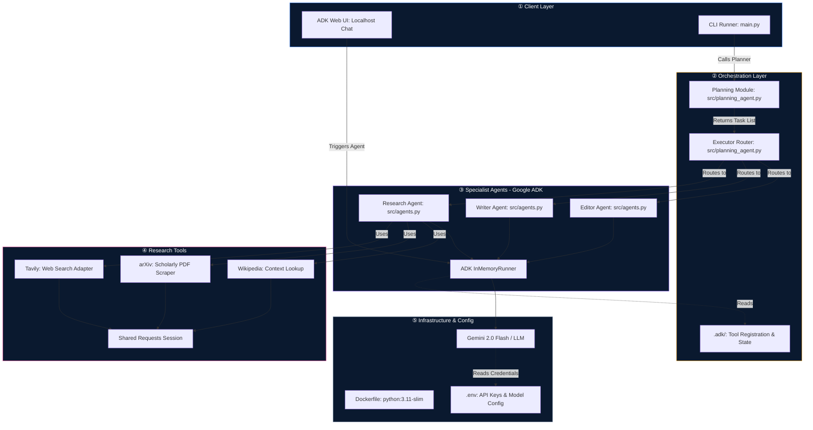

# Research Agent Project

## Overview
This repository contains a containerized research assistant built with Python and the Google Agent Development Kit (ADK). The system orchestrates large language model (LLM) agents to automate literature review, evidence synthesis, and technical writing for data science and machine learning workflows.

---

## Architecture


---

## Repository Structure

```text
.
├─ .adk/              # Local configuration and metadata for Google ADK
├─ docker/            # Container orchestration and startup scripts
├─ src/               # Application source code (agents, tools, orchestration)
├─ .env               # Environment variables (API keys, model configuration)
├─ Dockerfile         # Container image definition
├─ main.py            # Application entry point (API or CLI runner)
├─ README.md          # Project documentation
└─ requirements       # Python dependency specification
```

`.adk/`
The `.adk` directory stores configuration and cache data used by the Google Agent Development Kit. It typically includes project metadata, tool registration, and local state required to manage multi‑agent LLM workflows.

`docker/`
The `docker` folder contains scripts and configuration for building and running the application in a containerized environment. This includes entrypoint logic for launching the API server and any supporting services required by the research agents.

`src/`
The `src` directory holds the core application logic, including:
* Agent definitions for research, drafting, and editing tasks.
* Planning and execution modules that coordinate multi‑step research pipelines.
* Tool integrations for web search and scholarly retrieval (for example, Tavily, arXiv, and Wikipedia adapters).
These components work together to support reproducible literature reviews, structured report generation, and automated refinement of technical writing in data science and machine learning contexts.

`.env`
The `.env` file defines environment variables such as LLM provider keys, search API keys, and model configuration. Typical variables include:
* LLM API keys (for example, Gemini).
* Web research API keys (for example, Tavily).
* Optional configuration flags for model selection and runtime behavior.
Using `.env` allows you to keep credentials out of source control while enabling flexible experimentation with different models and tools.

`Dockerfile`
The `Dockerfile` specifies how to build a reproducible container image for the project. It installs Python, project dependencies, and the application code, then configures the runtime command used to launch the research service.

`main.py`
`main.py` is the primary entry point for the application. It typically wires together:
* The planning agent that decomposes a research question into sequential tasks.
* The executor that routes each task to the appropriate LLM agent (research, writer, editor).
* The serving interface (for example, a FastAPI app or CLI) used to trigger end‑to‑end research runs.

`README.md`
This file provides documentation for developers and practitioners working with the research agent. It explains the project structure, the purpose of each core component, and how the system supports automated literature review and technical report generation for data science and machine learning use cases.

`requirements`
The `requirements` file lists the Python packages required to run the project. Typical dependencies include:
* Google ADK and compatible LLM client libraries.
* HTTP and data‑processing libraries for integrating external research tools.
Installing these dependencies ensures that the research agents, planning logic, and orchestration components run consistently across environments.

---

