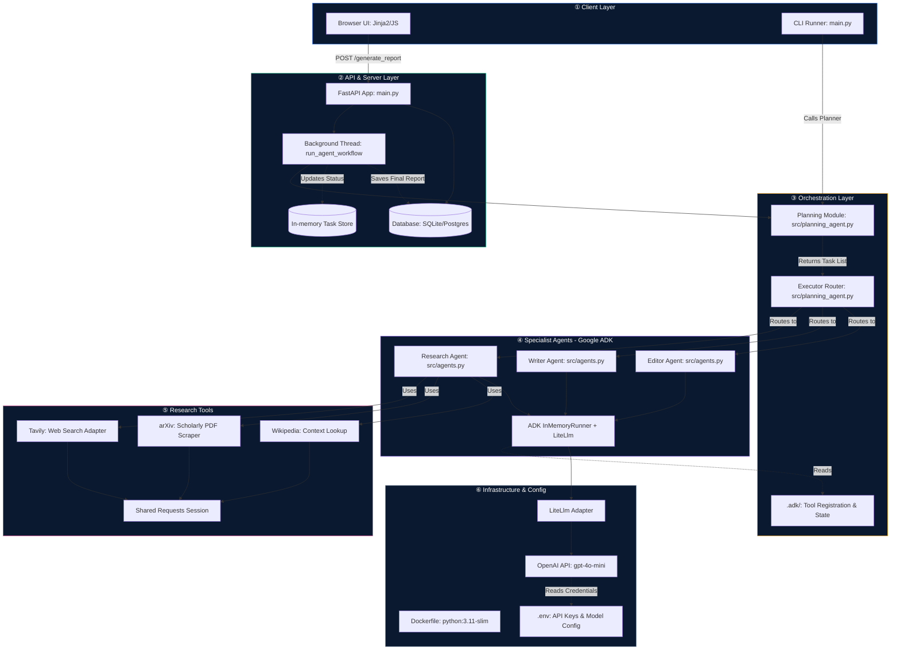

# Research Automation Agentic System

## Overview

This repository contains a containerized research assistant built with Python and the Google Agent Development Kit (ADK). The system orchestrates LLM agents to automate literature review, evidence synthesis, and technical writing for data science and machine learning workflows.

**Model backend:** [OpenAI API](https://platform.openai.com) — `gpt-4o-mini`, fast and affordable with excellent tool/function calling support via google-adk's `LiteLlm` adapter.

---

## Architecture



---

## Repository Structure

```text
.
├─ .adk/              # Local configuration and metadata for Google ADK
├─ docker/            # Container orchestration and startup scripts
├─ src/               # Application source code (agents, tools, orchestration)
├─ static/            # Static assets served by FastAPI
├─ templates/         # Jinja2 HTML templates for the web UI
├─ .env               # Environment variables (API keys, model configuration)
├─ Dockerfile         # Container image definition
├─ main.py            # Application entry point (FastAPI app)
├─ README.md          # Project documentation
└─ requirements.txt   # Python dependency specification
```

### Directory & File Descriptions

**`.adk/`**
Stores configuration and cache data used by the Google Agent Development Kit. Includes project metadata, tool registration, and local state required to manage multi-agent LLM workflows.

**`docker/`**
Contains scripts and configuration for building and running the application in a containerized environment. Includes entrypoint logic for launching the API server and any supporting services required by the research agents.

**`src/`**
Holds the core application logic:
- `agents.py` — Research, Writer, and Editor agent definitions (OpenAI via LiteLlm)
- `planning_agent.py` — Planner that decomposes topics into steps, and Executor that routes each step to the right agent
- `research_tools.py` — Tool integrations for Tavily web search, arXiv PDF scraping, and Wikipedia lookup
- `agent.py` — ADK entry point exposing `root_agent` for `adk web`

**`.env`**
Defines environment variables including LLM provider keys, search API keys, and model configuration. Keeps credentials out of source control while enabling flexible model selection.

**`Dockerfile`**
Specifies how to build a reproducible container image. Installs Python, project dependencies, and application code, then configures the runtime command to launch the research service.

**`main.py`**
Primary entry point. Wires together the planning agent that decomposes a research question into sequential tasks, the executor that routes each task to the appropriate LLM agent, and the FastAPI serving interface that triggers end-to-end research runs and streams progress to the UI.

**`requirements.txt`**
Lists all Python packages required to run the project, including `google-adk[extensions]` for LiteLlm support, `litellm` for OpenAI routing, and HTTP/data-processing libraries for research tool integrations.

---

## Quick Start

### 1. Get an OpenAI API key

1. Sign up at [platform.openai.com](https://platform.openai.com)
2. Go to **API Keys** → **Create new secret key**
3. Copy the key — it starts with `sk-`

### 2. Configure `.env`

```dotenv
OPENAI_API_KEY=sk-your_key_here
TAVILY_API_KEY=tvly-your_key_here

# Optional model override (default: gpt-4o-mini)
OPENAI_MODEL=gpt-4o-mini

DATABASE_URL=sqlite:///./research.db
```

### 3. Install & run locally

```bash
python -m venv .venv && source .venv/bin/activate
pip install -r requirements.txt   
uvicorn main:app --host 127.0.0.1 --port 8000 --reload
```

Open **http://localhost:8000** in your browser.

### 4. Run with Docker

```bash
docker build -t research-agent .
docker run -p 8000:8000 --env-file .env research-agent
```

---

## Supported OpenAI Models

Set `OPENAI_MODEL` in `.env` to switch.

| `OPENAI_MODEL` | Notes |
|---|---|
| `gpt-4o-mini` | **Default.** Fast, cheap, excellent tool calling |
| `gpt-4o` | Most capable, higher cost |
| `gpt-4.1-mini` | Latest affordable GPT-4.1 class |
| `gpt-4.1` | Highest capability in GPT-4.1 family |

---

## How the OpenAI Integration Works

google-adk's `LiteLlm` adapter supports OpenAI natively via the `openai/` prefix:

```python
# src/agents.py
from google.adk.models.lite_llm import LiteLlm

def _make_llm() -> LiteLlm:
    return LiteLlm(
        model="openai/gpt-4o-mini",
        api_key=os.getenv("OPENAI_API_KEY"),
    )
```

`gpt-4o-mini` handles planning, research tool calling (Tavily/arXiv/Wikipedia), writing, and editing — fast, affordable, and with reliable function calling.

---

## Environment Variables Reference

| Variable | Required | Default | Description |
|---|---|---|---|
| `OPENAI_API_KEY` | ✅ Yes | — | OpenAI API key (`sk-...`) |
| `OPENAI_MODEL` | No | `gpt-4o-mini` | Model to use for all agents |
| `TAVILY_API_KEY` | ✅ Yes | — | Tavily web search API key |
| `DATABASE_URL` | No | `sqlite:///./research.db` | SQLAlchemy DB URL |
| `POSTGRES_USER` | No | `app` | Postgres user (Docker only) |
| `POSTGRES_PASSWORD` | No | `local` | Postgres password (Docker only) |
| `POSTGRES_DB` | No | `appdb` | Postgres database name (Docker only) |
